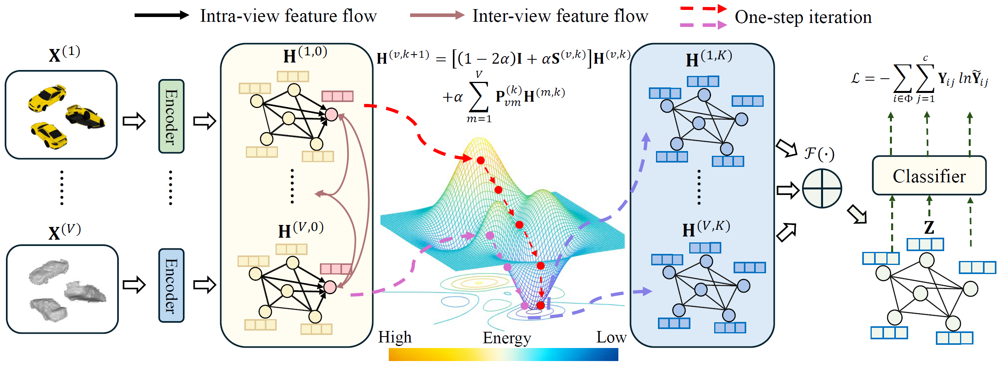

# ECMGD
Implementation of ECMGD in our paper: Towards Multi-view Consistent Graph Diffusion, ACM MM 2024.


====
This is the Pytorch implementation of ECMGD proposed in our paper:



## Requirement

  * Python == 3.9.12
  * PyTorch == 2.2.2
  * Numpy == 1.24.1
  * Scikit-learn == 1.4.1
  * Scipy == 1.12.0
  * Texttable == 1.7.0
  * Tqdm == 4.64.2

## Quick Start
Unzip the dataset files
```
unzip ./data/datasets.7z
```
For multi-view semi-supervised classification task, run 
```
python main.py --dataset BDGP
```
For heterogeneous graph node classification task, run 
```
python main_Iso.py --dataset ACM
```
For incomplete multi-view semi-supervised classification task, run
```
python main.py --dataset BDGP --Miss_rate 0.1
```

Note that the default parameters may not be the best to reproduce our results in the paper.


## Dataset
Please unzip the datasets folders saved in ```./data/HeteGraph.7z``` and ```./data/Multi-view.7z``` first.

```
data/
│
├── Multi-view/
│   ├── BDGP.mat
│   ├── HW.mat
│   ├── MNIST10k.mat
│
└── HeteGraph/
    ├── IMDB
    ├── YELP
    └── ACM
```

## Reference
```
@inproceedings{10.1145/3664647.3681258,
author = {Lu, Jielong and Wu, Zhihao and Chen, Zhaoliang and Cai, Zhiling and Wang, Shiping},
title = {Towards Multi-view Consistent Graph Diffusion},
year = {2024},
doi = {10.1145/3664647.3681258},
booktitle = {Proceedings of the 32nd ACM International Conference on Multimedia},
pages = {186–195},
}
```
 
